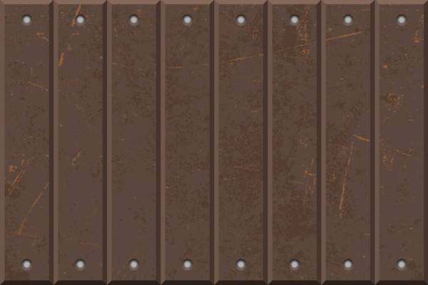
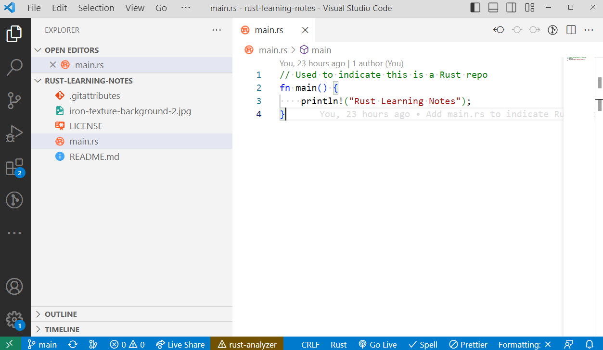

# Rust Learning Notes

## How to Learn Rust

On 3rd February 2023, I got a big inspiration to learn Rust thanks for this [Syntax.fm interview with Tim McNamara](https://syntax.fm/show/571/supper-club-rust-in-action-with-tim-mcnamara).

## About Me

I started programming in 1996 as a kid, learning Pascal, Assembly and C. I created the website of my elementary school in 1998.

I have been working professionally since 2007 as a front-end developer. My usual stack at the moment (2023) is TypeScript, JavaScript, Angular and React with some HTML5, CSS3 and SCSS coding. Sometimes I code backend in Node.js.

## Setting Up Development Environment

[Guide for using Rust in VS Code](https://code.visualstudio.com/docs/languages/rust).

## Rust by Example

A very practical learning resource is [Rust by Example](https://doc.rust-lang.org/stable/rust-by-example/), which features runnables, examples and ideas.

## Topics

Watch Tim's short introductory video: [Rust Linz, June 2021 - Tim McNamara - How to learn Rust](https://www.youtube.com/watch?v=sDtQaO5_SOw).

> When starting to learn Rust, focus on structs, vectors, iteration, Result and Option.

Recommended subjects:

* [Structures (structs)](https://doc.rust-lang.org/rust-by-example/custom_types/structs.html)
* [Vectors](https://doc.rust-lang.org/rust-by-example/std/vec.html)
* [Iteration](https://doc.rust-lang.org/rust-by-example/flow_control/for.html)
* [Result](https://doc.rust-lang.org/rust-by-example/error/result.html)
* [Option](https://doc.rust-lang.org/std/option/index.html)

## Recommended Books

* The Rust Programming Language
  * [free online version](https://doc.rust-lang.org/book/)
  * [paid book and ebook](https://nostarch.com/rust-programming-language-2nd-edition)
* Rust in Action
  * [publisher's book page](https://www.manning.com/books/rust-in-action)
  * [Amazon profile page](https://www.amazon.com/Rust-Action-TS-McNamara/dp/1617294551)

## Recommended Paid Courses

[Ultimate Rust Crash Course](https://www.udemy.com/course/ultimate-rust-crash-course/)

This video class was excellent:

* the content was well structured and not overly long
* there were many excercise tasks
* the teacher has humor and a great voice

## Microsoft Learn Courses

* [Take your first steps with Rust](https://learn.microsoft.com/en-us/training/paths/rust-first-steps/)
* [Beginner's Series to Rust](https://learn.microsoft.com/en-us/shows/beginners-series-to-rust/)

## Macros

I have never used macros before with a programming language, so this was very new for me.

* [Macros in Rust: A tutorial with examples](https://blog.logrocket.com/macros-in-rust-a-tutorial-with-examples/)
* [How I Learned to Stop Worrying and Love Macros](https://zdimension.fr/how-i-learned-to-stop-worrying-and-love-macros/)
* [A Beginner’s Guide to Rust Macros](https://medium.com/@phoomparin/a-beginners-guide-to-rust-macros-5c75594498f1)

## Picture credit

[Rusty Metal Vectors by Vecteezy.](https://www.vecteezy.com/free-vector/rusty-metal)